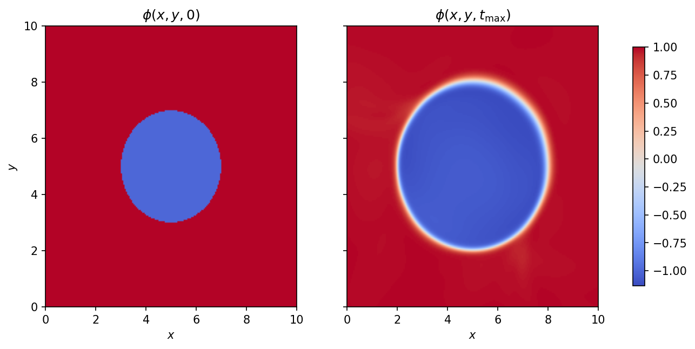
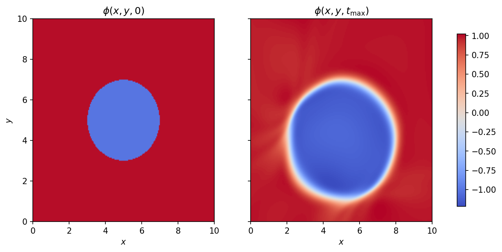
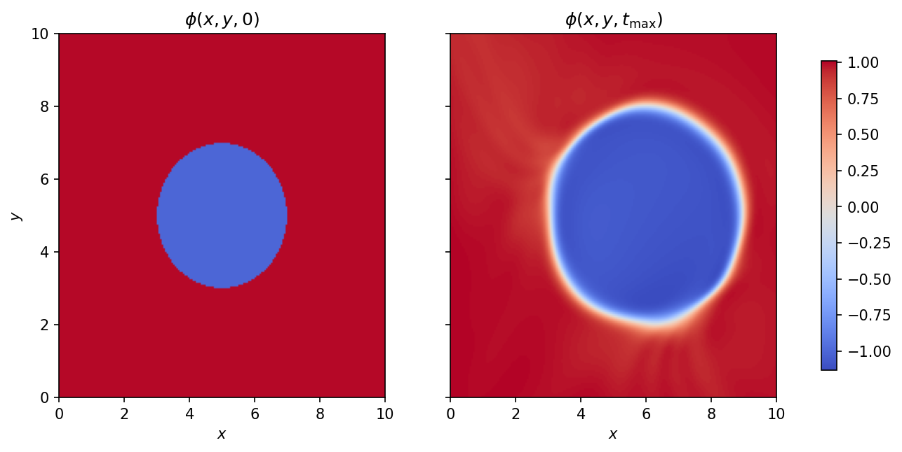
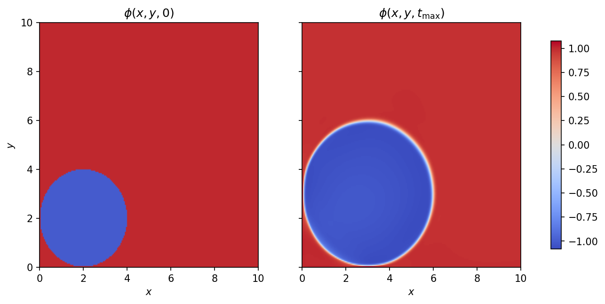

# Simulation Examples

This document showcases different fire propagation scenarios using PINNs-LSM-fire with varying wind conditions.

## Scenario 1: No Wind

Initial circular fire with no wind advection. The fire spreads uniformly in all directions with constant speed.

**Configuration:**
```ini
[lsm]
vx = 0.0
vy = 0.0
speed = 1.0
```

**Result:**


The fire front (φ=0 contour) expands uniformly as a circle, demonstrating pure normal propagation.

---

## Scenario 2: South Wind (Negative y-direction)

Fire with wind blowing from north to south (negative y-direction). The fire is stretched and accelerated southward.

**Configuration:**
```ini
[lsm]
vx = 0.0
vy = -1.0
speed = 1.0
```

**Result:**


The combined effect of advection (southward wind) and normal propagation elongates the fire front, creating an asymmetric pattern.

---

## Scenario 3: East Wind (Positive x-direction)

Fire with wind blowing from west to east (positive x-direction). The fire spreads faster in the eastern direction.

**Configuration:**
```ini
[lsm]
vx = 1.0
vy = 0.0
speed = 1.0
```

**Result:**


The wind carries the fire eastward, creating an elongated elliptical flame front that extends primarily in the x-direction.

---

## Scenario 4: Northeast Wind (Positive x and y-direction)

Fire with diagonal wind blowing toward the northeast. This is a more realistic scenario combining multiple wind components.

**Configuration:**
```ini
[lsm]
vx = 1.0
vy = 1.0
speed = 1.0
```

**Result:**


The diagonal wind creates a northeast-oriented fire front, demonstrating how the PINN correctly captures the combined advection effects.

---